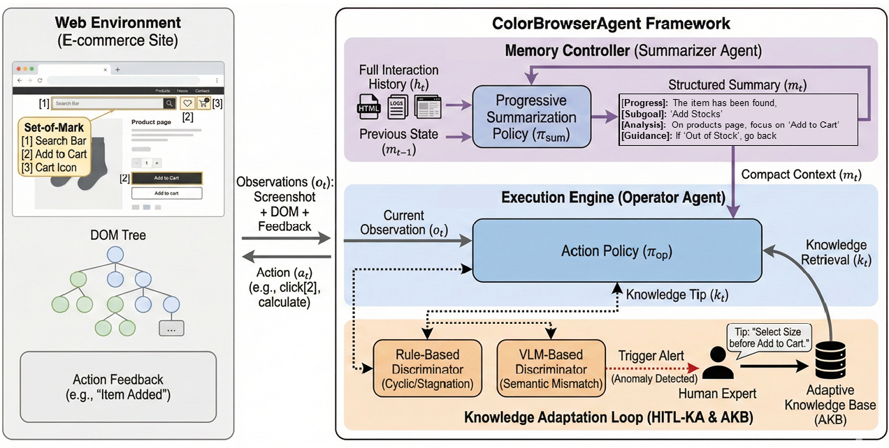

# 🤖 ColorBrowserAgent: An Intelligent GUI Agent for Complex Long-Horizon Web Automation



**ColorBrowserAgent** is a framework designed for **Collaborative Autonomy** in complex web tasks. By integrating **Progressive Progress Summarization** with **Human-in-the-Loop Knowledge Adaptation**, ColorBrowserAgent addresses the critical challenges of long-horizon stability and site heterogeneity in web automation.

📄 **Paper**: [arXiv:2601.07262](https://arxiv.org/abs/2601.07262) | **Code**: [GitHub](https://github.com/MadeAgents/browser-agent.git)

## 📋 Overview

ColorBrowserAgent tackles two fundamental challenges in web automation:
- **Long-Horizon Stability**: Prevents "decision drift" in extended interaction sequences through progressive memory compression
- **Site Heterogeneity**: Adapts to diverse web environments via Human-in-the-Loop Knowledge Adaptation

The framework adopts a **Human-Centred** approach that integrates human expertise into the agentic loop, creating a symbiotic collaboration between AI scalability and human adaptability.

### 🎯 Key Contributions

1. **Progressive Progress Summarization**: A Summarizer Agent that compresses trajectory history into fixed-length summaries with conditional corrective guidance, reducing context complexity from $O(T)$ to $O(1)$
2. **Human-in-the-Loop Knowledge Adaptation (HITL-KA)**: An autonomous trigger mechanism that solicits expert intervention only when needed, learning site-specific priors without retraining
3. **Dual-Agent Architecture**: Separates global planning (Summarizer) from execution (Operator) for robust long-horizon performance

For detailed methodology and technical details, please refer to our [paper](https://arxiv.org/abs/2601.07262).

## 📊 Performance

ColorBrowserAgent achieves **71.2% overall task success rate** on the [WebArena](https://arxiv.org/abs/2307.13854) benchmark using GPT-5, establishing a new state-of-the-art.

| Domain | Success Rate |
|--------|--------------|
| Reddit | **87.4%** |
| Shopping Admin | **76.4%** |
| Shopping | **72.9%** |
| GitLab | **65.7%** |
| Map | **55.9%** |
| **Overall** | **71.2%** |

See the [paper](https://arxiv.org/abs/2601.07262) for detailed ablation studies and domain-specific analysis.

## 🚀 Quick Start

### 📦 Requirements
- Python == 3.12
- UV package manager

### 1️⃣ Create Virtual Environment (Optional)

```bash
uv venv
source .venv/bin/activate  # Linux/Mac
# or
.venv\Scripts\activate  # Windows
```

### 2️⃣ Install Dependencies

```bash
uv pip install -r requirements.txt
playwright install chromium
```

### 3️⃣ Configure Environment Variables

```bash
cp .env.example .env
# Edit .env with your API keys and configurations
```

Example `.env` configuration:

```bash
OPENAI_API_KEY=your_api_key_here
OPENAI_API_BASE=your_api_base_url
WEBARENA_SHOPPING_URL=http://localhost:7770
WEBARENA_REDDIT_URL=http://localhost:9999
```

For WebArena Docker environment setup, refer to the [official documentation](https://github.com/web-arena-x/webarena/blob/main/environment_docker/README.md).

### 4️⃣ Usage

**Running WebArena Tasks**
```bash
python agent/run_webarena.py \
    --task shopping_admin \
    --task_ids 3 \
    --exp demo \
    --model_name gpt-5
```

**Enabling Human-in-the-Loop Knowledge Adaptation**

1. Create site-specific knowledge files in `agent/tips/`
2. Enable with `--tips true` flag

Example tips structure:

```text
# Shopping Website Tips
- Navigate using dropdown menus when possible
- Select shipping method before 'Place Order' button becomes interactive
- Return product category (e.g., "books") rather than specific names
```

## 📚 Documentation

- **Paper**: [arXiv:2601.07262](https://arxiv.org/abs/2601.07262) - Full technical details and experimental results
- **Trajectory Results**: [Trajectory Documentation](trajectories/README.md)
- **BrowserGym Modifications**: [NOTICE](NOTICE) file

## 📄 License

This project is licensed under the Apache License 2.0. See [LICENSE](LICENSE) for details.

## 🙏 Acknowledgments

This project builds upon:
- [BrowserGym](https://github.com/ServiceNow/BrowserGym) - Web automation framework
- [WebArena](https://github.com/web-arena-x/webarena.git) - Benchmark for web agents

## 📧 Contact

For questions, collaboration, or research inquiries:
- Open an issue on GitHub
- Submit a pull request
- Contact the authors

---